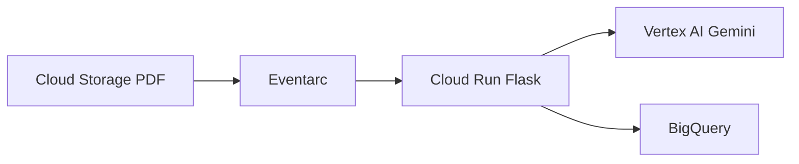

# Extractor de boletines Corabastos

Servicio en Cloud Run que procesa PDFs de boletines de precios subidos a Cloud Storage: extrae tablas con **Gemini (Vertex AI)** e inserta filas en **BigQuery**.

## Flujo



1. Se sube un PDF al bucket.
2. Eventarc notifica a Cloud Run (`POST /`).
3. Si el archivo no fue procesado, Gemini extrae un JSON estructurado.
4. Las filas validadas se insertan en BigQuery con `fecha`, `archivo_origen`, `inserted_at` y `modelo_usado`.

## Esquema BigQuery sugerido

```sql
CREATE TABLE `project.dataset.precios_corabastos` (
  fecha DATE,
  categoria STRING,
  producto STRING,
  presentacion STRING,
  cantidad INT64,
  unidad STRING,
  precio_extra INT64,
  precio_primera INT64,
  precio_por_unidad INT64,
  variacion STRING,
  archivo_origen STRING NOT NULL,
  inserted_at TIMESTAMP,
  modelo_usado STRING
)
PARTITION BY fecha;
```

La idempotencia consulta si ya existe alguna fila con el mismo `archivo_origen`.

## Variables de entorno

| Variable | Obligatorio | Default | Descripción |
|----------|-------------|---------|-------------|
| `GCP_PROJECT` | Sí | — | Proyecto GCP |
| `GCP_LOCATION` | No | `us-central1` | Región Vertex AI |
| `BQ_TABLE` | Sí | — | `project.dataset.table` |
| `GEMINI_MODEL` | No | `gemini-2.5-flash` | Modelo principal |
| `GEMINI_MODEL_FALLBACK` | No | `gemini-2.5-flash` | Modelo con thinking si falla validación |
| `GEMINI_THINKING_BUDGET` | No | `1024` | Presupuesto thinking (solo fallback) |
| `GEMINI_MAX_RETRIES` | No | `3` | Reintentos ante errores transitorios |
| `ALLOWED_BUCKET` | No | — | Si se define, rechaza otros buckets (403) |
| `REQUIRE_PDF` | No | `true` | Ignora objetos que no terminan en `.pdf` |
| `STRICT_FECHA` | No | `false` | Error 422 si no hay fecha en el nombre |
| `SKIP_IF_PROCESSED` | No | `true` | Omite PDFs ya presentes en BQ |

## Permisos IAM (cuenta de servicio de Cloud Run)

- `roles/aiplatform.user` — Vertex AI / Gemini
- `roles/bigquery.dataEditor` — insertar y consultar en la tabla
- `roles/storage.objectViewer` — leer PDFs del bucket (vía URI `gs://`)

Configurar Cloud Run con **requiere autenticación** y Eventarc con invocación autenticada (OIDC).

## Desarrollo local

```bash
python -m venv .venv
.venv\Scripts\activate   # Windows
pip install -r requirements-dev.txt
pytest --cov=app --cov-report=term-missing
```

## Despliegue directo a Cloud Run (consola)

Configuración del proyecto:

| Parámetro | Valor |
|-----------|-------|
| Proyecto | `aplicacionagro-461801` |
| Servicio | `procesador-boletines` |
| Región | `us-central1` |
| Tabla BQ | `aplicacionagro-461801.dataset_corabastos.precios_diarios` |
| Bucket | `corabastos-boletines-diarios` |

Cuenta GCP: `jmgalindor9802@gmail.com` (proyecto `aplicacionagro-461801`).

**Primera vez** (login + perfil gcloud):

```powershell
.\setup-gcloud.ps1
```

**Desplegar:**

```powershell
.\deploy.ps1
```

```bash
# Linux / macOS
chmod +x deploy.sh && ./deploy.sh
```

## Despliegue con Cloud Build (opcional)

Sustituciones en `cloudbuild.yaml`:

- `_REGION`, `_SERVICE_NAME`, `_AR_REPO`, `_BQ_TABLE`, `_ALLOWED_BUCKET`

```bash
gcloud builds submit --config=cloudbuild.yaml \
  --substitutions=_REGION=us-central1,_SERVICE_NAME=procesador-boletines,_AR_REPO=corabastos,_BQ_TABLE=aplicacionagro-461801.dataset_corabastos.precios_diarios,_ALLOWED_BUCKET=corabastos-boletines-diarios
```

## Estructura del proyecto

```
app/
  config.py           # Variables de entorno
  events.py           # Parseo Eventarc / Pub/Sub
  fecha.py            # Fecha desde nombre de archivo
  models.py           # Validación Pydantic
  gemini_service.py   # Vertex AI + reintentos + thinking fallback
  bigquery_service.py # Idempotencia e inserción
  handler.py          # Orquestación del flujo
main.py               # Flask (POST /, GET /health)
tests/                # Pruebas unitarias con mocks
```

## Limitaciones conocidas (v1)

- Si Gemini OK pero BigQuery falla, un reintento de Eventarc volverá a llamar a Gemini.
- No hay MERGE ni tabla de locks; la idempotencia es por consulta previa a `archivo_origen`.
- La autenticación del endpoint se delega a IAM de Cloud Run (sin verificación JWT en código).
